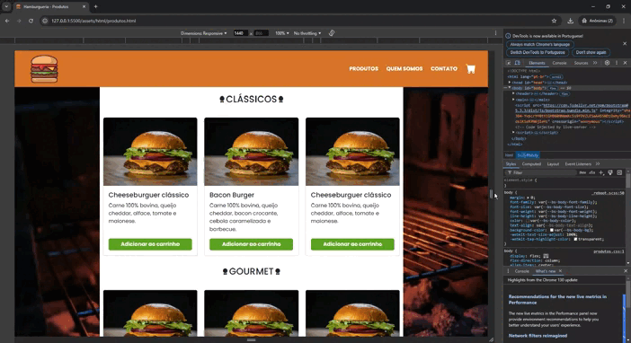
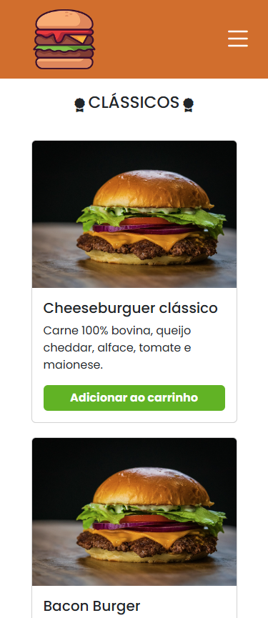
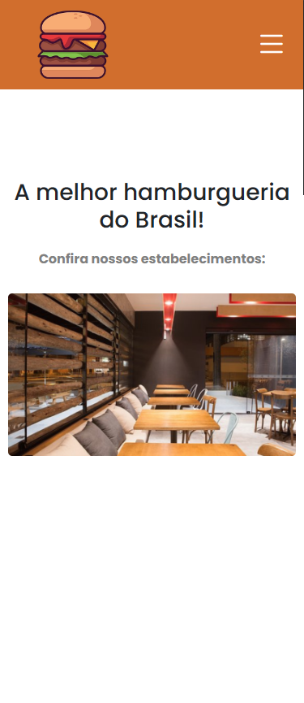
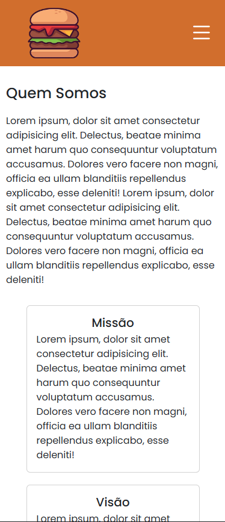
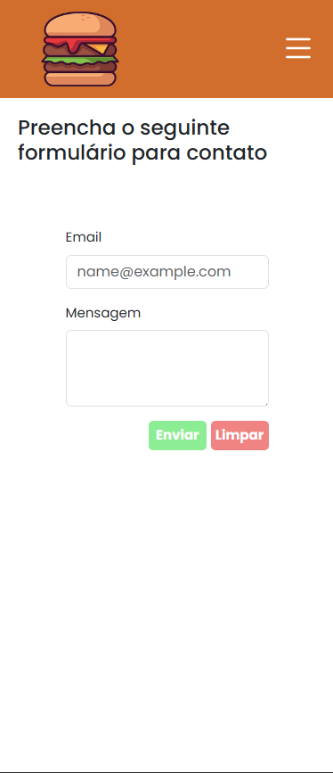
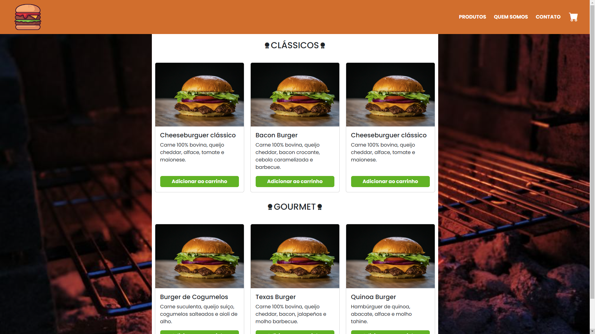
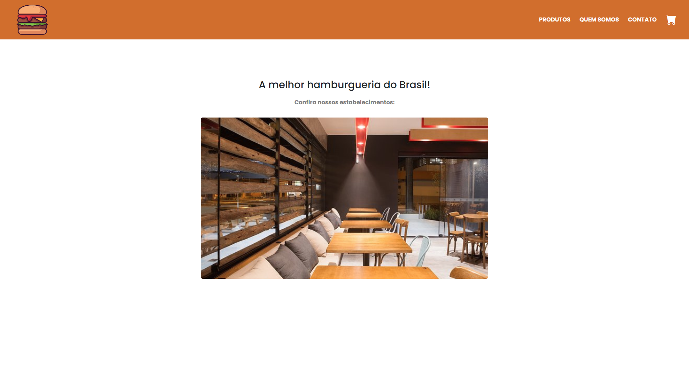
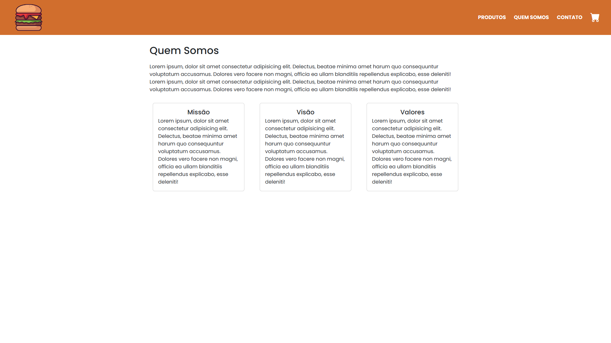
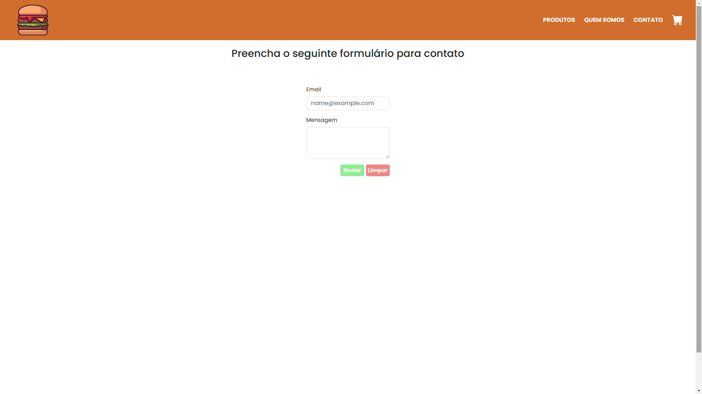

**Tempo de confecção:** Cerca de 8 horas.  
**Marca:** Não foi definido nenhuma identidade visual antes da confecção, pois o objetivo principal era utilizar e praticar o uso das ferramentas do desenvolvimento web, bem como o framework _Bootstrap_.

## Responsividade
Durante o tempo de confecção a maior parte deste foi dedicado a questões de responsividade de todas as páginas, com a aplicação de um _menu hambúrguer_.  

  

## Imagens do Conteúdo
O site foi idealizado não só para comportar o _layout desktop_ mas também o _mobile_.

### Mobile

  
Produtos

  

  
Início

  

  
Quem Somos

  

  
Contato

  

### Desktop

  
Produtos

  
Início

  
Quem Somos

  
Contato

